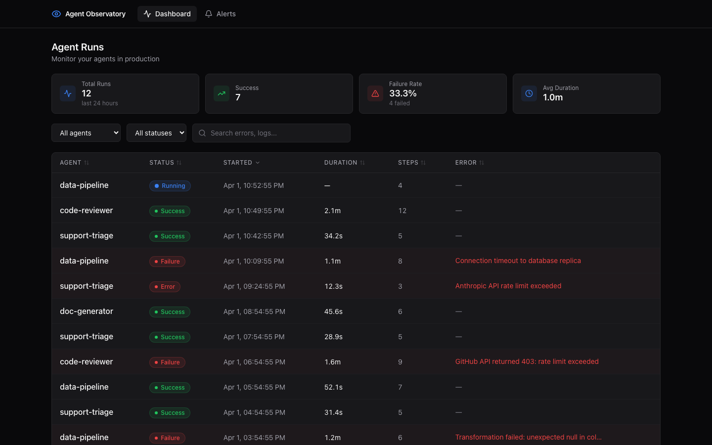
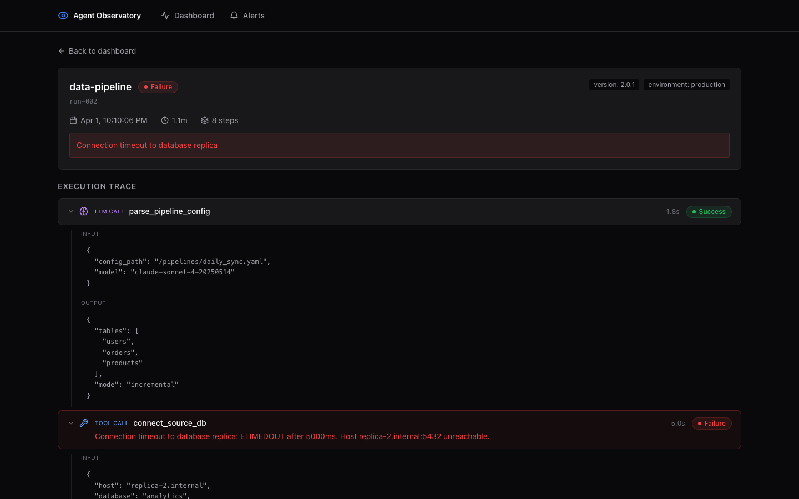
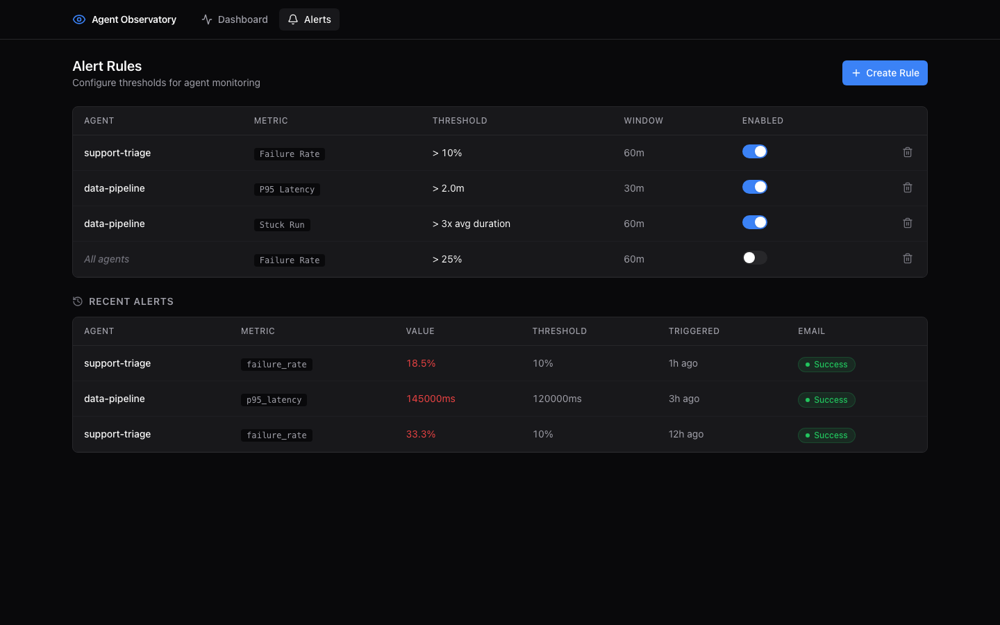

# Agent Observatory

Production observability for AI agents. Dashboard with run overview, trace viewer, search/filtering, and alerts.

## Screenshots

### Dashboard
Run overview with stats, filters, and sortable table. Failed runs highlighted in red.



### Trace Viewer
Drill into any run to see the full execution timeline with nested steps, inputs/outputs, and error details.



### Alerts
Configure alert rules per agent (failure rate, P95 latency, stuck run detection) with email notifications.



## Quick Start

```bash
# 1. Start all services
docker compose up -d

# 2. Run migrations
cd backend && alembic upgrade head

# 3. Seed demo data (optional)
cd backend && python scripts/seed.py

# 4. Open the dashboard
open http://localhost
```

## Development

### Backend (FastAPI)

```bash
cd backend
python3 -m venv .venv && source .venv/bin/activate
pip install -e ".[dev]"

# Start PostgreSQL
docker compose up -d db

# Run migrations
alembic upgrade head

# Start dev server
uvicorn app.main:app --reload --port 8000

# Run tests
pytest tests/ -v
```

### Frontend (React + Vite)

```bash
cd frontend
npm install
npm run dev    # http://localhost:5173
```

### Send a test event

```bash
curl -X POST http://localhost:8000/api/v1/ingest \
  -H "Content-Type: application/json" \
  -d '{
    "run_id": "550e8400-e29b-41d4-a716-446655440000",
    "agent_name": "my-agent",
    "step_type": "run_start",
    "status": "success",
    "timestamp": "2026-03-30T14:00:00Z"
  }'
```

## Architecture

```
Frontend (React/TS) --> Nginx :80 --> Backend (FastAPI) :8000 --> PostgreSQL :5432
                                           |
                        APScheduler: alerts (1m), retention (daily)
```

## API Endpoints

| Method | Endpoint | Description |
|--------|----------|-------------|
| POST | `/api/v1/ingest` | Ingest log events (single or batch) |
| GET | `/api/v1/runs` | List runs with filters and pagination |
| GET | `/api/v1/runs/stats` | Summary statistics |
| GET | `/api/v1/runs/{id}` | Run detail with nested trace |
| GET | `/api/v1/agents` | List discovered agents |
| CRUD | `/api/v1/alerts/rules` | Alert rule management |
| GET | `/api/v1/alerts/history` | Triggered alert history |

## Environment Variables

Copy `.env.example` to `.env` and configure:

| Variable | Default | Description |
|----------|---------|-------------|
| DB_PASSWORD | devpassword | PostgreSQL password |
| SMTP_HOST | (empty) | SMTP server for alert emails |
| ALERT_RECIPIENTS | (empty) | Comma-separated email addresses |
| RETENTION_DAYS | 30 | Days to retain data |
